# drawio2ink – Parse a narrative XML from draw.io through R to ink

# Table of Contents

 [Getting Started](#getting-started)

- [Prerequisites](#prerequisites)
- [Installing](#installing)

[Build a story](#build-a-story)

- [Building a valid narrative flow chart](#building-a-valid-narrative-flow-chart)

[Using the app](#using-the-app)

- [Configure the output of the app](#configure-the-output-of-the-app)

[Built With](#built-with)

[Contributing](#contributing)

[Authors](#authors)

[License](#license)

[Acknowledgments](#acknowledgments)

This ShinyApp works as a simple XML-Parser-Web-Interface. The app and parser are written in **R**. The parser converts an XML file exported from the [free online diagram tool draw.io](https://www.draw.io/) to the [narrative scripting language ink](https://www.inklestudios.com/ink/). The generated output is therefore a **.ink** file. This file can then be further processed and edited in the [ink-editor Inky](https://github.com/inkle/inky). We at the Süddeutsche Zeitung used this app to quickly and easily parse a story in draw.io-flow chart XMl-structure because we edited the story often. The resulting longread [can be found here](https://projekte.sueddeutsche.de/artikel/politik/urlaub-und-klimakrise-fliegen-sie-noch-e282839/) (behind our paywall, though).

## Getting Started

### Prerequisites

You need a recent **R** version installed on your system. You can [download and install it from here](https://cran.r-project.org/). This app was built with R version **3.5.3** (2019-03-11), but it should run with earlier versions as well.

You don't have to have the IDE [**RStudio**](https://www.rstudio.com/products/rstudio/download/#download) installed, but it helps tremendously in coding with R. For example, in this case it automatically provides a "Run App" button if you work on a ShinyApp.

All the **R packages** you need to have installed are installed and/or loaded in the app.R file and should be installed automatically when running the app. In case you run into problems, here's the list as well:

* *shiny* – for the web app
* *shinythemes* – for an eye-pleasing theme
* *here* – manage the shiny-directories
* *xml2* – parse XML files
* *dplyr* – data manipulation
* *purrr* – looping and manipulating the lists from the XML
* *stringr* – manipulate strings/characters
* *readr* – read/write functions
* *glue* – glue strings and variables together

### Installing

You can run this app with RStudio or via the command line:

#### Using RStudio

1. Clone/download the repo.
2. Open `app.R` in RStudio
3. Click "Run App"

A new browser window/tab should open with the ShinyApp interface like this:

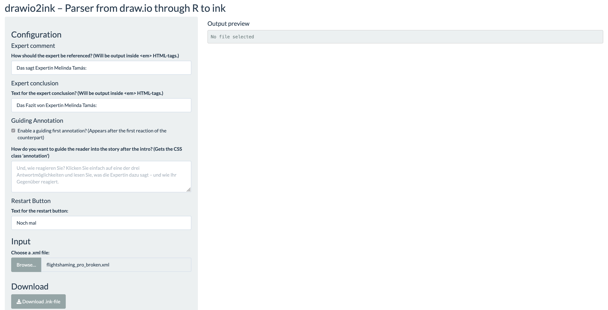

#### Using the command line

1. Same as above
2. Open the app directory (where app.R lies) in a terminal
3. Open the R shell by typing `R`
4. Run the app and open the browser window via these two commands:
    ```R
    > library(shiny)
    > shinyAppFile("app.R")
    ```

## Build a story

### Building a valid narrative flow chart

There are some pre-defined assumptions you have to consider building a flow chart for your story in draw.io if you want this parser to work.

The script identifies the types of story elements (option text box, arrow etc.) by looking at their `style` attribute in the XML file. These are not perfectly consistent, i.e. styles get appended in the XML attribute if you change it in draw.io. These are the settings in the script:

```r
type = case_when(
        str_detect(style, "orthogonalLoop") ~ "arrow",
        str_detect(style, "endArrow")       ~ "arrow",
        str_detect(style, "rounded=1")      ~ "textbox",
        str_detect(style, "rounded=0")      ~ "textbox",
        str_detect(style, "ellipse")        ~ "textbox",
        str_detect(style, "shape=hexagon")  ~ "textbox",
        str_detect(style, "text")           ~ "textbox",
        TRUE                                ~ "other"
        )
```

In the next step the script differentiates different types of **text boxes**:

```r
textbox_type = case_when(
        type == "textbox" & str_detect(style, "rounded=1")     ~ "option",
        type == "textbox" & str_detect(style, "rounded=0")     ~ "reaction",
        type == "textbox" & str_detect(style, "ellipse")       ~ "expert",
        type == "textbox" & str_detect(style, "shape=hexagon") ~ "reaction",
        type == "textbox" & str_detect(style, "text")          ~ "other_text",
        TRUE                                                   ~ "none"
        )
```

This translates into the following rules for draw.io

#### Styles/Shapes

The **first reaction** has the shape "hexagon":

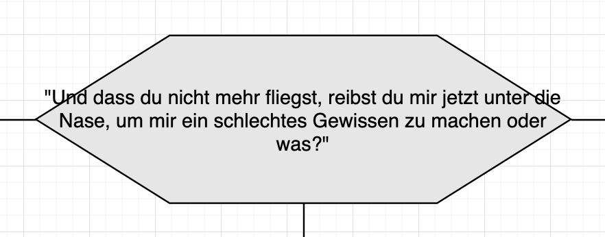

All **other reaction text** boxes have the style "rounded=0", sharp corners:

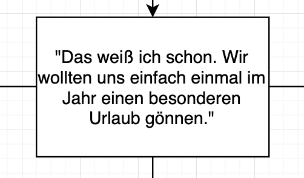

**Option text boxes** – which the reader clicks – have the style "rounded=1", rounded corners:

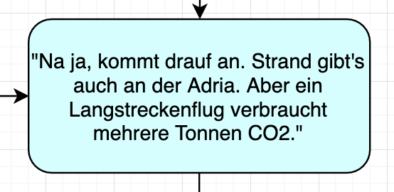

**Expert quote** text boxes have the style "ellipse":

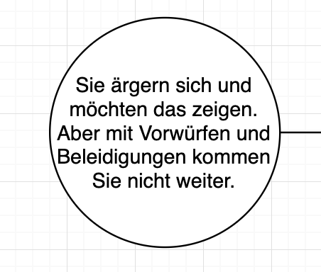

Text that's not in a bubble has the style "text" and will be discarded.

**Arrows** can have the styles "orthogonalLoop" or "endArrow".

#### Connections

It is **very important** that all arrows are properly connected at the start and the end. Otherwise the script will return an error:

```error
Error: There are disconnected arrows. Please visit your draw.io and fix them.
```

or, if you deployed it on a server it might be:

```error
Error: An error has occurred. Check your logs or contact the app author for clarification.
```

How do you spot a disconnected arrow?

Disconnected:

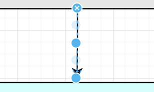

Connected:

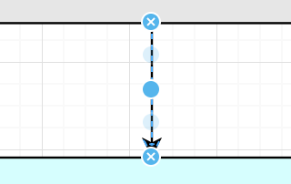

Also connected:

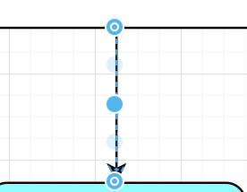

Another important point are the expert comments and conclusions. The script interprets a text box with only a target but no source as an expert text box. So they have to look like this:

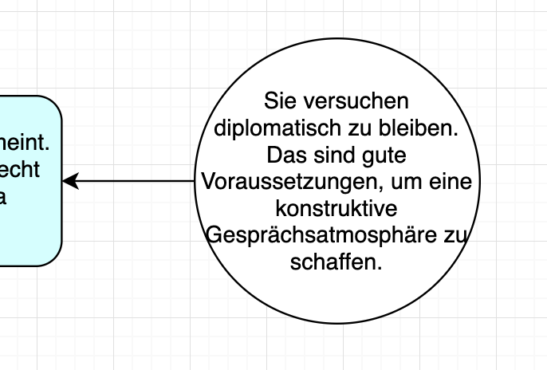

If such an expert text box is connected to a final reaction text box – which have only a source but no target – it will be interpreted as an expert conclusion at the end of a narrative string.

If you're finished with your narrative flow chart you can **export it as an XML file**. It's important to export it **uncompressed**, otherwise it will contain gibberish.

## Using the app

### Configure the output of the app

You can configure some aspects of the output `.ink` file. The first two options have small previews with example text so you can spot errors like a missing colon without sifting through the ink file.

#### Expert Comment

The expert comment is a short sentence before the quote of the expert. We show this quote below your answer after you've chosen one (in this case, the yellow text box):

**The option in the app**
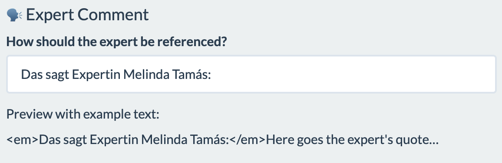

**Example from our article**
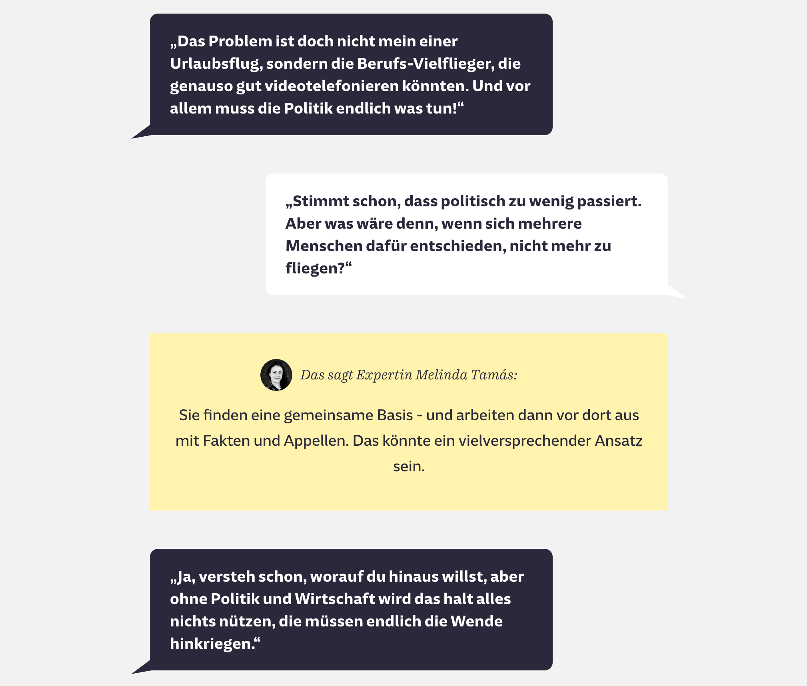

#### Expert Conclusion

You can also configure the expert conclusion text. This is very similar to the in-between comment quote, it just shows at the end of a narrative string (again, in yellow):

**The option in the app**
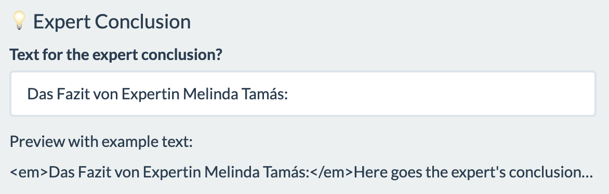

**Example from our article**
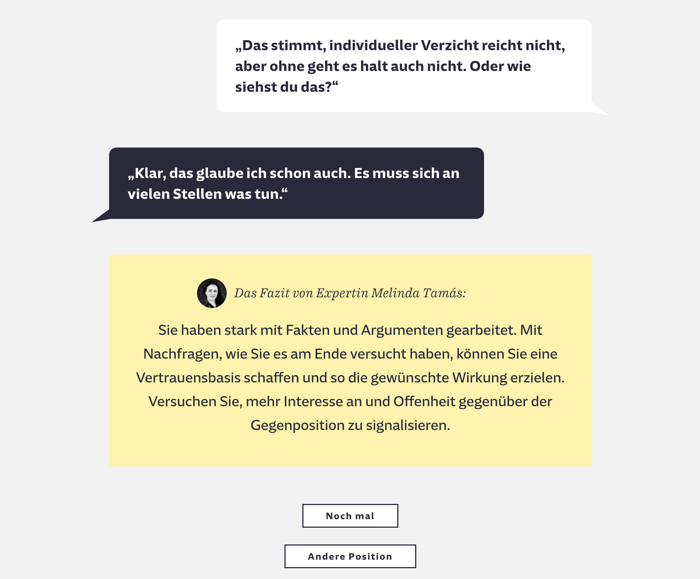

in case you're wondering if you can configure the small portrait image of the expert: This comes through CSS. All the style comes through CSS as well. The output of this parser enables you to open it in Inky and export a JSON with the story content, which will be rendered on your website (via ink-js, for example).

#### Restart Button

Customize the text on the restart button:

**The option in the app**
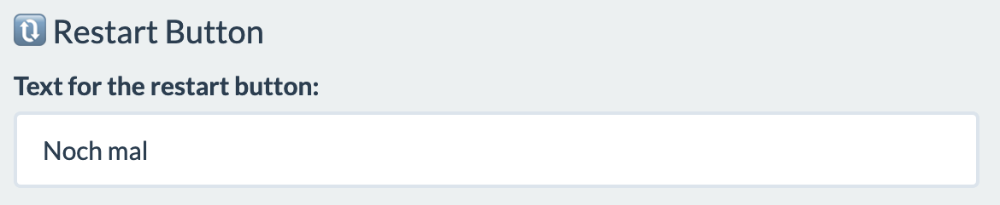

**Example from our article**
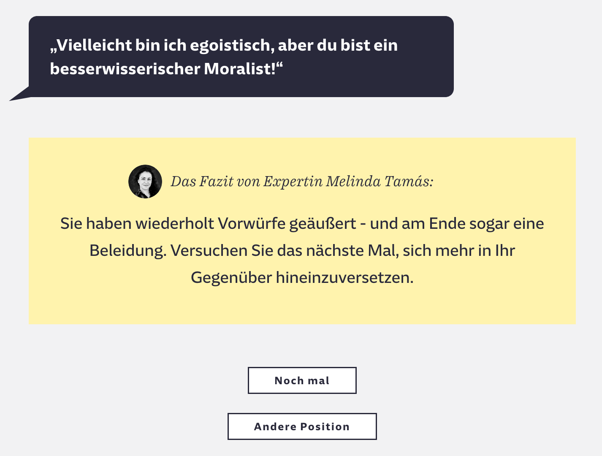

The "Andere Position" – other position – button is coded in Javascript. It won't appear in your downloaded ink file.

#### Optional: Introductory Annotation

In our case, we wanted to help the reader get into the discussion. So after the first reaction of the opponent, we explicitly asked the reader in a separate box to click on one of the three dialogue choices. You can turn this off or customize it. This output can be styled separately through the CSS class `annotation`.

**The option in the app**
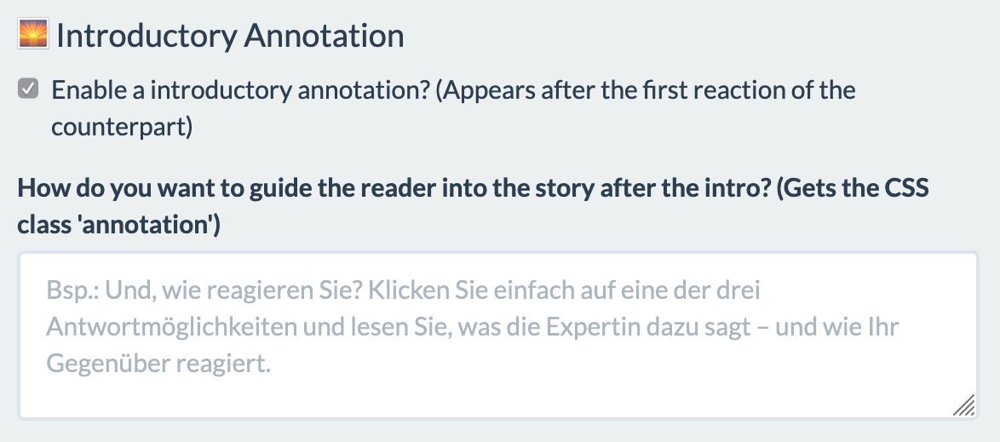

**Example from our article**
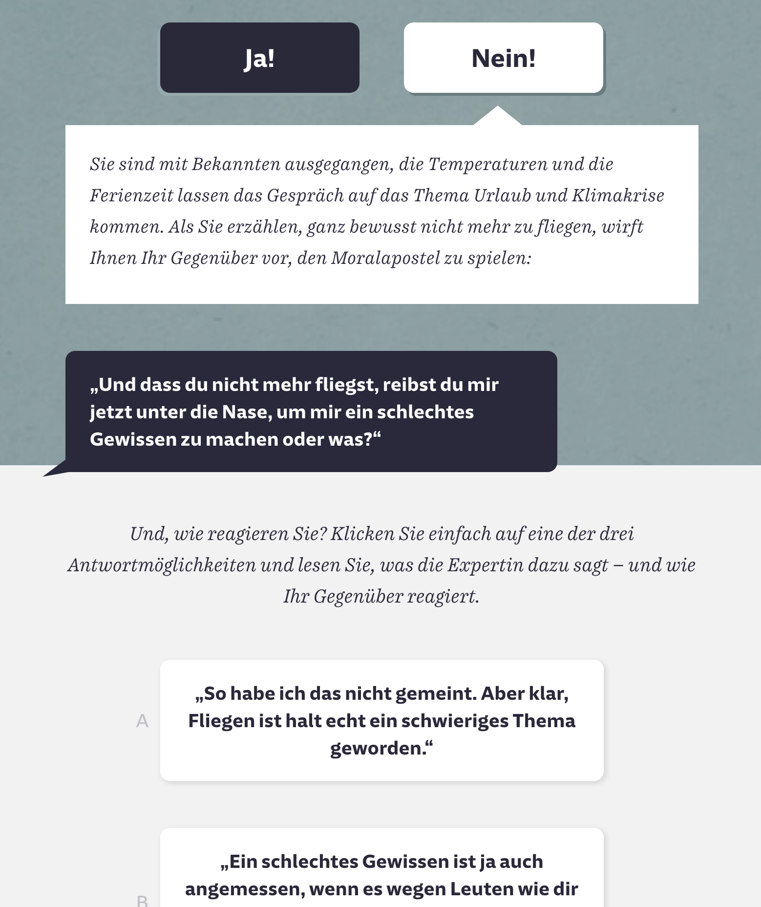

If you're done configuring the output, you can upload the XMl file you've exported from draw.io (uncompressed!), check the big preview and download the ink file!

## Built With

* [R](https://cran.r-project.org/) - The programming language used
* [Shiny](https://shiny.rstudio.com/) - Web-App framework for use with R

## Contributing

We have no guidelines for contributing to this repository yet. Feel free to contact the team, if you encounter problems or have suggestions.

## Authors

* **Moritz Zajonz** - *Initial work* - [enigmoe](https://github.com/enigmoe)

See also the list of [contributors](https://github.com/sueddeutsche/drawio2ink/contributors) who participated in this project.

## License

This project is licensed under the MIT License - see the [LICENSE.md](LICENSE.md) file for details

## Acknowledgments

* Hat tip to [@munichrocker](https://github.com/munichrocker), who helped with the concept of the parser
